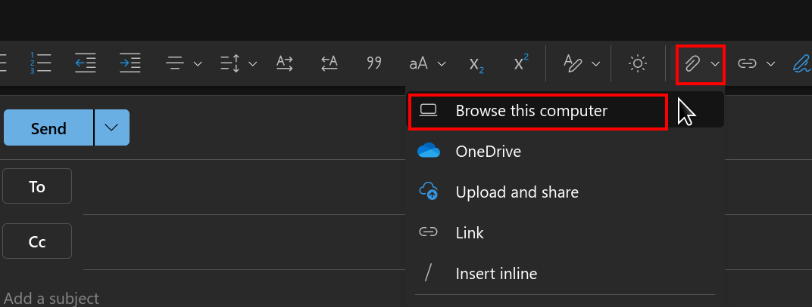
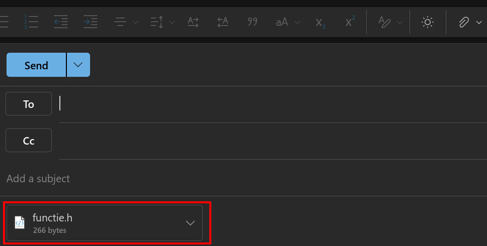
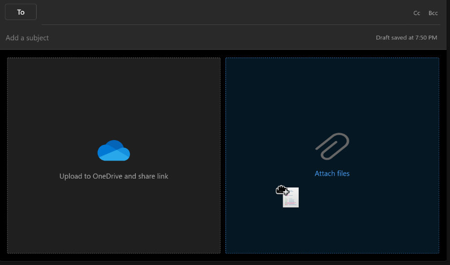
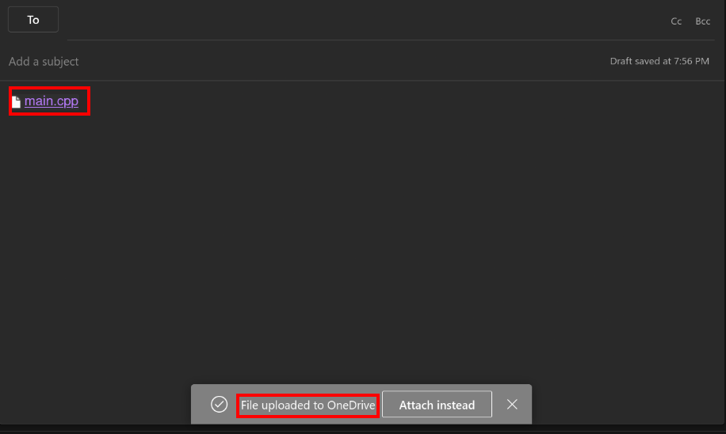

Câteva sfaturi pentru colocviu
- cel mai important este să trimiteți un cod în **C++** care **compilează**
- **numele fișierului trebuie să înceapă cu numărul grupei!** exemple: `130_Popescu_Ion.cpp`, `260_Ionescu_Ion.zip`
- **fără goto!**
- **fără `#define N 5`! folosiți `const int N = 5`**
- **fără câmpuri/atribute publice!**
- **fără variabile globale!**
- **fără `conio.h`, fără `windows.h` și alte headere specifice unui SO!**
- **fără binare/executabile în arhivă!**
- **verificați că fișierele nu sunt atașate ca fișiere pe OneDrive!!!** Mailul de la Universitate (Outlook)
  are tendința să vă înlocuiască atașamentele în fișiere OneDrive, mare atenție!!
- mailul se trimite de pe adresa instituțională

Un fișier adăugat corect ca atașament va arăta astfel:

**Atenție când atașați fișiere cu drag and drop!!!** Trebuie să vă arate "Attach files", nu "Upload to OneDrive".
În exemplul de mai jos, ar veni să faceți drag&drop în partea dreaptă:

Un fișier atașat **greșit** va arăta așa:

- **verificați încă o dată că arhiva nu conține binare/executabile!**
- **fără tot codul direct în clasă! folosiți "split into declaration and definition"**
- **nu pierdeți timpul!** folosiți conceptele de oop care se scriu cel mai repede 😁
- **nu trimiteți codul în ultimul moment!** rezervați-vă 5-10 minute la sfârșit
- **exersați _din timp_ să scrieți repede!**
- nu pierdeți timpul cu comentarii evidente; dpmdv nu ajută la nimic
- aveți voie cu `using namespace std;` (dar pot să dau puncte bonus dacă nu folosiți asta în fișiere header)
- puteți scrie codul în fișiere separate sau într-un singur fișier, ce vi se pare mai rapid
- pe ce ar trebui să luați multe puncte ușor:
  - constructori de inițializare
  - moșteniri (virtuale multiple - unde punem virtual?), funcții virtuale **pure**
  - excepții (cu moștenire din `std::exception`)
  - `operator<<`
  - id_max static
    - dacă id-ul simplu este const, trebuie suprascris cc/op= pt că altfel compilatorul nu generează cc/op=
- folosiți `std::string` în loc de `char*`, folosiți `std::vector` în loc de `A *vec = new A[nr]` (și `delete[]`)
- recomandarea mea e să folosiți `std::shared_ptr`: așa pot să dau puncte bonus pe smart pointeri și nu sunteți depunctați pt eventuale memory leaks
- nu folosiți citiri de la tastatură/nu pierdeți timpul să testați dacă merge citirea; dacă faceți cu citire de la tastatură și chiar vreți să testați dacă merge, salvați-vă undeva într-un notepad/comentariu datele de intrare, pentru ca apoi să faceți doar "paste"
  (ca să câștigați timp să nu scrieți aceleași date de fiecare dată când testați programul)
  - verificați dacă merge acest truc înainte de colocviu, nu atunci pe loc; nici mie nu îmi merge din prima

Shortcuts pentru CLion (și alte editoare de la JetBrains):
- <kbd>Shift</kbd>+<kbd>F6</kbd> redenumiri
- <kbd>Ctrl</kbd>+<kbd>Alt</kbd>+<kbd>V</kbd> extrage variabilă
- <kbd>Ctrl</kbd>+<kbd>Alt</kbd>+<kbd>M</kbd> extrage funcție
- <kbd>Alt</kbd>+<kbd>Insert</kbd> în interiorul clasei generează cod: constructor, destructor, getter/setter, `op<<`, `op==`, `op!=`, `op<`
- <kbd>Ctrl</kbd>+<kbd>O</kbd> override, suprascrie funcție virtuală
- <kbd>Ctrl</kbd>+<kbd>B</kbd> mergi la declarație
- <kbd>Ctl</kbd>+<kbd>D</kbd> duplică linia sau selecția
- <kbd>Ctrl</kbd>+<kbd>Space</kbd> auto-complete
- <kbd>Alt</kbd>+<kbd>Enter</kbd> quick fix (nu oferă întotdeauna cea mai bună soluție!): de exemplu, pentru `#include`, definit funcții, clase, variabile
- <kbd>Alt</kbd>+<kbd>J</kbd> selectează același cuvânt și pune mai multe cursoare; detalii [aici](https://www.jetbrains.com/help/clion/multicursor.html#column_selection)
- <kbd>Tab</kbd> pentru a accepta o sugestie și a înlocui token-ul existent (<kbd>Enter</kbd> pune sugestia curentă, însă lasă bucata de token existentă)
- de 2 ori <kbd>Shift</kbd>: caută peste tot
- <kbd>Ctrl</kbd>+<kbd>/</kbd> (de)comentează la nivel de linie
- <kbd>Ctrl</kbd>+<kbd>Shift</kbd>+<kbd>/</kbd> (de)comentează la nivel de bloc
