# Configurarea mediului de lucru

### ⚠ Puneți cât mai multe întrebări! Nu există întrebări greșite.
#### Semnalați orice fel de greșeli găsiți!

Avem de configurat următoarele programe:
- un compilator
- un editor/IDE
- Git ca sistem de versionare a codului

Compilatorul și editorul sunt în majoritatea situațiilor programe **complet independente**.
Editorul este folosit ca să scriem cod, compilatorul este folosit ca să transforme codul
într-un fișier binar (executabil sau bibliotecă).

Exemple de compilatoare: GCC (GNU Compiler Collection), (LLVM) Clang, Apple Clang,
MSVC (Microsoft Visual C++), Intel C++ Compiler, NVCC (Nvidia CUDA Compiler) etc.

Exemple de editoare/IDE: Code::Blocks, CLion, VSCode, vim, emacs, nano, gedit, XCode,
Visual Studio, Notepad etc.

---

**Atenție!**

Code::Blocks **nu** este compilator.
MinGW **nu** este compilator.
MinGW-w64 **nu** este compilator.
CLion **nu** este compilator.
VSCode **nu** este compilator.
Visual Studio **nu** este compilator.
XCode **nu** este compilator.
C++ **nu** este compilator (C++ este un limbaj).
C++14 **nu** este compilator (C++14 este o versiune a limbajului C++).

---

Am văzut confuzia asta de prea multe ori și recunosc că este și greșeala mea că nu am ilustrat
mai clar diferența și nu am fost prea insistent. Poate cu explicațiile de aici se va remedia confuzia.
Sau măcar să vă amintiți imaginea de mai jos când aveți dileme
([sursa](https://www.ranzey.com/generators/bart/index.html)).


**Ce este MinGW?**

MinGW este o colecție de pachete software din Linux portate pe Windows pentru a folosi apelurile native
ale sistemului de operare (Windows API). Printre pachetele software incluse se regăsește și o portare
a colecției de compilatoare GCC.

**Ce este MinGW-w64?**

MinGW-w64 este o continuare a proiectului MinGW pentru a funcționa pe variante de Windows pe 64 de biți
și pentru a aduce tot felul de îmbunătățiri. MinGW pare un proiect abandonat.

**De ce nu e corect să spunem că MinGW/MinGW-w64 este un compilator?**

Dacă vrem să specificăm versiunea compilatorului, versiunea de MinGW este irelevantă pentru că putem
avea versiuni de compilator diferite cu aceeași versiune de MinGW: puteți vedea pe WinLibs că avem
5 versiuni majore de GCC (de la 8 la 12) care folosesc aceeași versiune de MinGW-w64 (9.0.0).


## Configurarea compilatorului

Indiferent de sistemul de operare, vă recomand să folosiți versiuni cât mai noi de compilator, ideal
GCC minim versiunea 10 sau Clang minim versiunea 10.

#### Windows

Dacă folosiți CLion, puteți trece direct la [acest pas](#configurarea-și-utilizarea-programului-git).

Este necesar să adăugăm compilatorul în cale (variabila de mediu numită `%PATH%`)
dacă vrem să îl accesăm mai ușor din linia de comandă.

Dacă folosiți CLion ca IDE, versiunea de MinGW-w64/GCC inclusă este nouă și vine cu GCC >= 11.
Totuși, dacă aveți probleme cu biblioteci externe, recomand să luați GCC >= 10 de pe WinLibs, varianta
cu MSVCRT runtime (nu UCRT runtime).

Pe Windows, vă recomand să folosiți GCC/Clang furnizate de [WinLibs](https://winlibs.com). Nu recomand
compilatorul celor de la Microsoft dacă nu îl aveți deja instalat pentru că ocupă foarte mult spațiu
pe disc. Celelalte variante cu MSYS2 și/sau Cygwin mi se par prea complicate pentru ce avem nevoie
la acest laborator, iar binarele de la MinGW-w64 sunt mai vechi (GCC 8).

Ar fi de preferat să dezarhivați arhiva într-un loc unde calea absolută nu conține spații.

**Adăugarea compilatorului în cale**

Căutăm folder-ul `bin` al compilatorului nostru și verificăm să existe executabilul `g++.exe`:

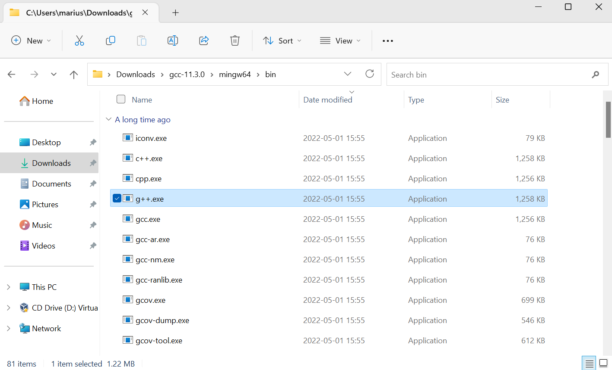

Copiem calea absolută a folder-ului `bin`:


Mergem în setările pentru variabile de mediu:

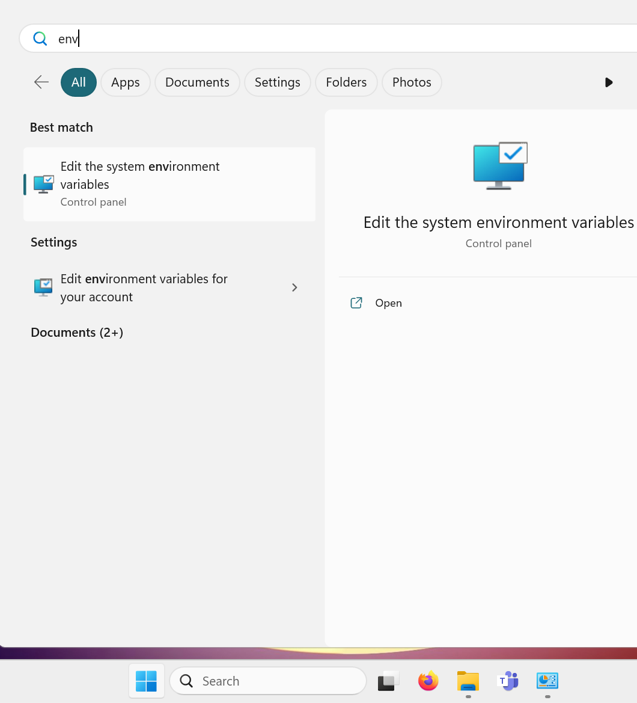

Selectăm opțiunea `Environment Variables...`:

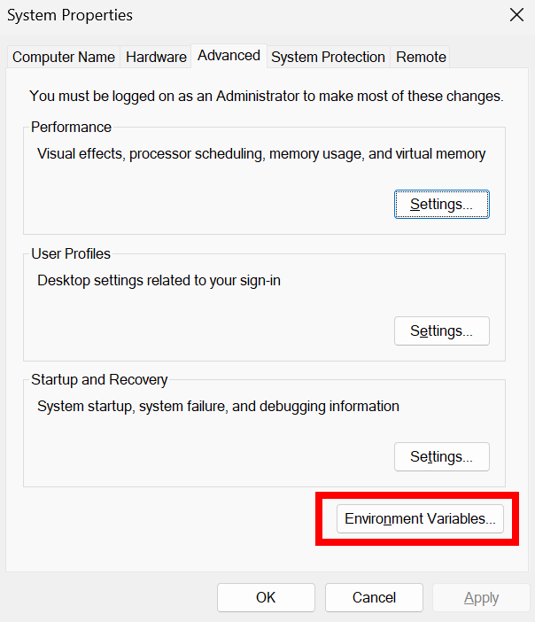

Modificăm variabila numită `Path` (sau `PATH`) la nivel de user sau de sistem (nu ar trebui să conteze):
întâi selectăm variabila cu un click, apoi apăsăm pe `Edit...`:


Apăsăm pe `New` pentru a adăuga o nouă intrare în variabila de cale:

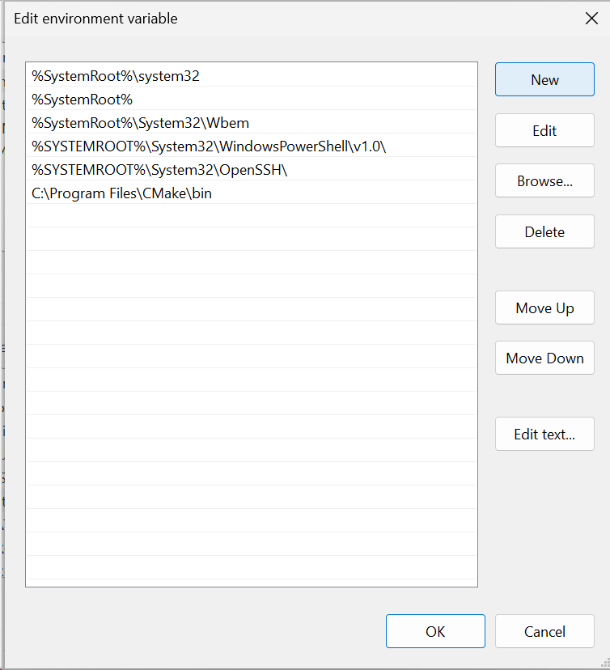

Punem calea copiată la primul pas (în cazul meu, `C:\Users\marius\Downloads\gcc-11.3.0\mingw64\bin`):


Apăsăm pe `OK`, apoi închidem celelalte ferestre deschise.

#### Linux

Dacă aveți deja instalată o versiune relativ recentă de compilator, puteți sări momentan peste acest pas.

Pe Ubuntu (sau alte derivate din Debian), ar trebui să fie suficiente următoarele instrucțiuni
(pentru GCC 11):
```
sudo add-apt-repository ppa:ubuntu-toolchain-r/test
sudo apt update
sudo apt install gcc-12 g++-12
```

Ar trebui să găsiți instrucțiuni asemănătoare pentru alte distribuții de Linux.

Compilatorul ar trebui să fie deja adăugat în cale (variabila `$PATH`).

#### macOS

Pe macOS ar trebui să aveți deja instalat Apple Clang. Dacă aveți nevoie de versiuni mai noi
sau de Clang/GCC, cred că cel mai ușor ar fi cu [brew](https://brew.sh).
Apple Clang nu preia toate modificările din Clang.

Compilatorul ar trebui să fie deja adăugat în cale (cred că variabila se numește tot `$PATH`).

### Verificarea versiunii compilatorului

Dacă folosiți CLion, vedeți acest pas la secțiunea următoare.

Indiferent de sistemul de operare, deschideți un terminal și introduceți comanda
`g++ --version` sau `clang++ --version` sau `g++-12 --version` etc. (după caz).

Exemple de terminal: Command Prompt/Powershell/Windows Terminal/Terminal/sh/bash/zsh.

Ar trebui să vă apară ceva de felul următor:


Dacă nu vă apare versiunea corespunzătoare, încercați să schimbați ordinea căilor către
compilatoare în `PATH` (butonul `Move up` pentru prioritate mai mare). Pentru a vedea unde se află compilatorul vechi,
folosiți comanda
`where` sau `whereis`.

Exemplu pe Windows:

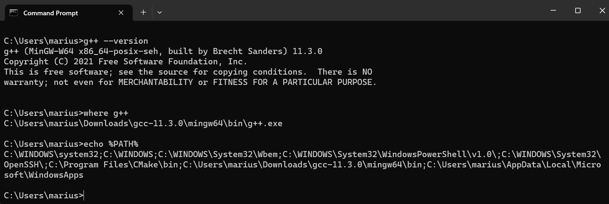

Exemplu pe Linux:


## Configurarea editorului

Alegerea editorului/IDE-ului este complet subiectivă. În cadrul laboratorului nu le putem încerca pe toate.
Eu vă recomand [CLion](https://www.jetbrains.com/clion/download/) pentru că are multe shortcuts
gata configurate și m-am obișnuit să-l folosesc.
Pentru a primi licență gratuită pe perioada studiilor, completați
[acest formular](https://www.jetbrains.com/shop/eform/students/) cu adresa instituțională
(`@s.unibuc.ro`).

Nu vă recomand CLion dacă nu aveți destul RAM. Se poate reduce consumul de RAM limitând valorile
parametrilor de [aici](https://www.jetbrains.com/help/clion/performance-tuning-tips.html).

Pe Windows, CLion vine cu o versiune nouă de GCC, deci nu mai aveți nimic de făcut.

Dacă nu aveți un compilator relativ nou, pasul următor este să vă configurați editorul
pentru a folosi compilatorul configurat mai sus.

Pentru alte editoare, mă puteți ajuta să completez acest ghid.

Pentru CLion: Customize -> All settings... -> Build, Execution, Deployment -> Toolchains

Exemplu pe Linux:


Apoi, ca să vedem versiunea compilatorului folosit, facem un proiect de test și
ne uităm jos în tab-ul CMake:

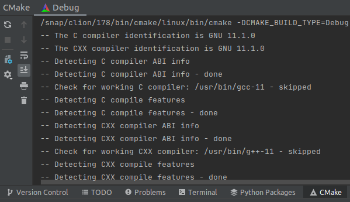

Dacă am făcut modificări la toolchain după ce a rulat CMake și nu apare versiunea pe care o vrem,
trebuie să resetăm cache-ul:

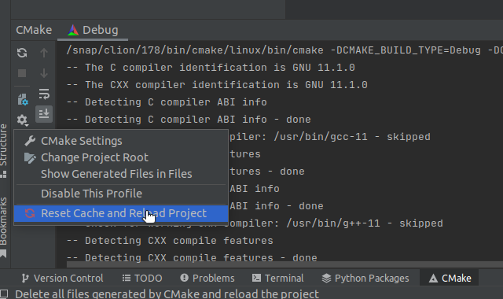

### Despre CMake

CMake este un instrument care generează fișiere de configurare pentru sisteme de build.

De ce e util un sistem de build? Ca să fie mai ușor să compilăm codul în paralel și
să nu recompilăm fișierele care nu s-au modificat.

Sistemul de build apelează compilatorul pentru a genera executabilul. Totuși, sistemele de build
depind de sistemul de operare.

CMake generează într-un mod portabil aceste fișiere de configurare și execută sistemul de build.
Aș vrea să folosim CMake pentru că este mai ușor când adăugăm biblioteci externe.
Multe biblioteci externe folosesc deja CMake.

Las [aici](https://www.jetbrains.com/help/clion/quick-cmake-tutorial.html) un tutorial cu CLion și CMake.

Dacă nu folosiți CLion, vă puteți uita pe
[CMakeLists.txt din repository-ul template](https://github.com/mcmarius/oop-template/blob/main/CMakeLists.txt).

[//]: # (https://cliutils.gitlab.io/modern-cmake/)

[//]: # (https://github.com/ttroy50/cmake-examples)

Dacă nu vreți să folosiți nici CMake, ne facem timp și configurăm CI-ul să funcționeze cu alternativa
dorită de voi.

## Configurarea și utilizarea programului Git

### Instalare

Dacă folosiți CLion, editorul vă poate ajuta să instalați Git cu un singur buton.

🚧

Alternativ, pe Windows, cel mai simplu este să folosiți [Git for Windows](https://gitforwindows.org).
NU vă recomand să vă setați ca editor implicit `vim` (selectați orice altceva).
După pasul cu editorul puteți da next/next până la sfârșit.

Pe Linux probabil e suficient cu `sudo apt install git` sau ceva asemănător.

Pe macOS, Git ar trebui să fie deja instalat. Dacă vă trebuie o versiune mai nouă, folosiți brew.

Verificați dintr-un terminal că programul este instalat corect cu `git --version`:

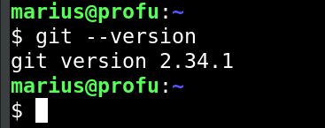

Observație: pe Windows, terminalul trebuie deschis după ce ați instalat git.

### Crearea unui repository remote

Dacă nu aveți deja cont, va trebui să vă creați unul. Cel mai la îndemână serviciu ar fi GitHub, însă
puteți folosi și alte servicii care lucrează cu repository-uri de git.

Pentru proiectul de POO, vă recomand să folosiți sau să vă inspirați din
[acest repository template](https://github.com/mcmarius/oop-template) (chiar dacă nu folosiți GitHub).
Apăsați pe butonul "Use this template". Dacă alegeți această variantă, puteți trece la pasul următor.

[**Mai multe detalii despre repository-ul template găsiți aici.**](setup.md)

Dacă nu folosiți repository-ul template, va trebui să vă configurați voi CMakeLists ca să vă apară
warnings. De asemenea, va trebui să vă configurați voi serviciul de CI (GitHub Actions sau ceva similar).
Cereți ajutor dacă nu vă iese ceva.

Pentru a crea un repository pe GitHub, folosim butonul ➕ din dreapta sus, apoi "New repository".
Pentru a putea folosi proiectul și local, ar fi bine să bifăm măcar una dintre opțiuni
(de exemplu cea de "Add a README file") pentru ca repository-ul nostru să aibă cel puțin un commit.
Dacă nu avem măcar un commit, putem întâmpina diverse erori.

### Configurare inițială

La user puneți numele userului de GitHub sau numele din GitHub (ca să apară contribuțiile). La email puteți pune
"your_github_username@users.noreply.github.com" dacă nu doriți ca adresa de email să fie publică.

```
git config --global user.name "Your Name"
git config --global user.email "your_email@example.com"
```

Setările globale sunt salvate în fișierul `.gitconfig` din
[folderul Home](https://en.wikipedia.org/wiki/Home_directory) al userului.
Setările la nivel de repository sunt în fișierul `config` din folderul `.git`. 

### Clonarea unui repository

Din browser, de pe pagina principală a repository-ului, apăsați pe butonul "Code", iar apoi copiați
URL-ul din tab-ul HTTPS:

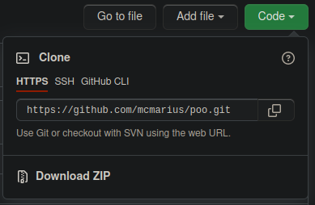

```
git clone https://github.com/mcmarius/poo.git
```

[//]: # (TODO clonare din interfața grafică)

Comanda `clone` face mai multe lucruri: inițializează un repository local, face legătura dintre
repository-ul local și cel remote (de pe GitHub) și aduce local conținutul de pe remote. Dacă
nu specificăm și alte opțiuni, vom prelua local tot istoricul modificărilor.

După aceasta, veți avea un folder cu numele repository-ului - `poo` pe exemplul de aici.
Dacă vă uitați la fișierele ascunse din acest folder, veți observa un folder `.git`. Aici își ține
programul Git toate fișierele de care are nevoie.

Așadar, un repository este un folder normal, dar care conține acest folder special `.git`.

### gitignore

Repository-ul template ar trebui să fie deja configurat cu un fișier `.gitignore`.

Dacă l-ați creat separat, dar ați pus bifa de .gitignore când ați creat repository-ul,
atunci aveți deja creat acest fișier.

Altfel, va trebui să creați fișierul cu ajutorul editorului sau din linia de comandă. Pe Windows, din
File Explorer trebuie creat ca `.gitignore.` deoarece trebuie păcălit să creadă că fișierul are și
nume, și extensie.

Vă recomand să vă uitați pe repo-ul template sau să folosiți
[gitignore.io](https://gitignore.io) pentru a completa fișierul `.gitignore`.

Ce rol are acest fișier?

Ne ajută să **nu** punem pe repository fișiere executabile, fișiere obiect, fișiere locale de
configurare ale editorului și alte fișiere care nu sunt de interes pentru altcineva care ar dori
să folosească repository-ul respectiv. De exemplu, executabilele nu sunt de interes deoarece se
schimbă la fiecare recompilare și sunt specifice unui anumit sistem de operare.

## Comenzi uzuale de Git

### TL;DR

#### Prima dată o singură dată pe calculator

```shell
git config --global user.name "mcmarius"
git config --global user.email "mcmarius@users.noreply.github.com"
```

#### Prima dată pentru fiecare proiect

```shell
git clone https://github.com/mcmarius/oop-template.git
```

#### De fiecare dată

```shell
git pull  # sau git pull origin main
# opțional: git diff
git add main.cpp laborator.h laborator.cpp
# sau dacă vrem să adăugăm tot: git add .
# opțional: git status
# opțional: git diff --cached
git commit -m "Reparat bug la formula de notare de laborator"
# sau git commit
# și se va deschide un editor pentru un mesaj mai detaliat
# opțional: git status
# opțional: git show  # pentru a vedea la ce am făcut commit
git push  # sau git push origin main
```

#### TL;DR din interfața grafică

Avem 3 butoane în dreapta sus pe care le vom apăsa în ordine:

- săgeata albastră este echivalentă cu `git pull`
- bifa este pentru commit
- săgeata verde este pentru `git push`


Folosim opțiunea de "merge". Pentru "rebase" este mai complicat.

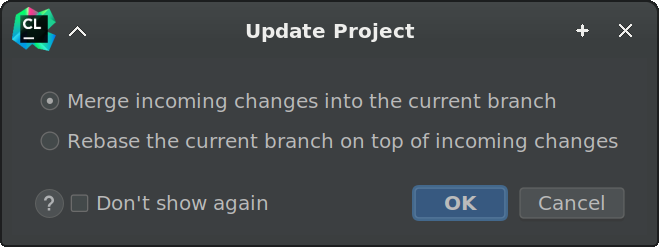

Pentru a adăuga fișierele la care să facem commit, se va deschide un panou în stânga.

Bifăm fișierele pe care vrem să le adăugăm:


Scriem un mesaj de commit care să reflecte modificările făcute (eventual detaliat):

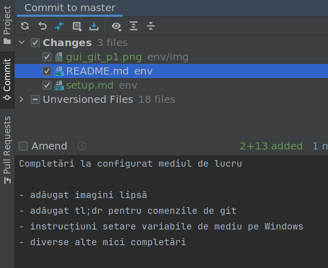

Dăm pe rotița din dreapta butonului "Commit and Push..." și bifăm
"Reformat code" și "Rearrange code". După aceea, apăsăm pe "Commit"
sau "Commit and Push...":

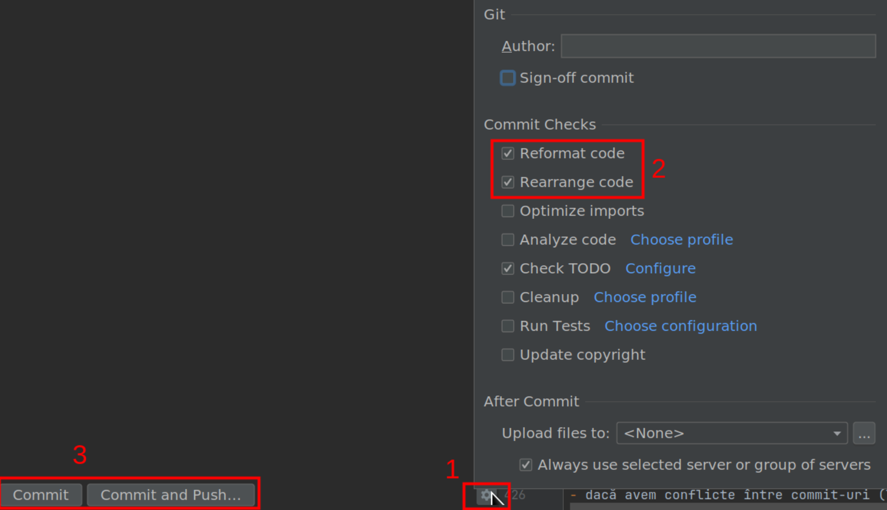

Opțional, dacă dorim să vedem ce s-a modificat (înainte sau după ce am făcut commit),
apăsăm pe butonul cu 2 săgeți albastre:


### Detaliat

De cele mai multe ori, vom folosi `git` dintr-o interfață grafică. Totuși, este bine să avem o vagă
idee despre modul de utilizare din linia de comandă, deoarece interfețele grafice mai dau rateuri
și atunci tot din linia de comandă va trebui să remediem situația.

### `git clone`

Pentru explicații, vedeți mai sus. Exemple: 
- `git clone https://github.com/mcmarius/oop-template.git` clonează în folderul `oop-template`
- `git clone git@github.com:mcmarius/oop-template.git` clonează folosind SSH
- `git clone https://github.com/mcmarius/oop-template.git folder` clonează în folderul `folder`
- `git clone --depth 2 https://github.com/mcmarius/oop-template.git` ia doar ultimele 2 commit-uri

Dacă am configurat o cheie de SSH într-o locație non-standard, comanda de clonare va fi următoarea:

```shell
# -c sau --config
# -i de la identity
git clone -c core.sshCommand="ssh -i ~/.ssh/gh_ed25519" git@github.com:user/repo.git
```

### `git status`

Una dintre cele mai utile comenzi. Arată informații despre starea curentă a repository-ului și ne
indică ce comenzi uzuale putem da.

Ce putem vedea?
- ce fișiere propunem să fie adăugate pentru următorul commit
- ce comandă putem da pentru a scoate fișiere din a fi adăugate la următorul commit
- ce fișiere urmărite de Git au fost modificate de la ultimul commit
- pe ce branch suntem
- dacă avem conflicte între fișiere
- dacă avem conflicte între commit-uri (local vs remote)
- dacă avem commit-uri locale și nu le-am transmis la repository-ul remote
- și nu numai

### `git diff`

Ne arată ce fișiere au fost modificate de la ultimul commit, dar care nu au fost adăugate pentru a fi
incluse în următorul commit.

E mult mai ușor și comod de lucrat cu diffs dintr-o interfață grafică, mai ales când avem de rezolvat
conflicte. Totuși, pentru modificări mici, poate fi mai rapid din linia de comandă.

### `git add`

Adaugă un fișier (sau mai multe) pentru ca modificările să fie incluse în următorul commit. Dacă Git
nu "urmărește" deja modificările asupra fișierului, fișierul este marcat ca fiind "urmărit" de Git.

**Atenție!** Dacă adăugăm un fișier și apoi îl modificăm, fișierul trebuie adăugat din nou dacă
vrem ca toate modificările să fie incluse.

Executați comenzile din următorul exemplu și încercați să înțelegeți ce se întâmplă:
```shell
git status
# modificăm/adăugăm fișierul main.cpp
git status
git diff main.cpp
git add main.cpp
# modificăm din nou fișierul main.cpp
git status
git diff main.cpp
# verificați ce se întâmplă
git add main.cpp
git status
git diff main.cpp
# dar acum?
```

Cum putem vedea modificările fișierelor adăugate pentru următorul commit? Cu opțiunea
 `--cached` (sau `--staged`).

Opțiunea `-w` ignoră modificările spațiilor.

De asemenea, poate fi utilă opțiunea `--check` dacă avem conflicte (de verificat cu și fără `--cached`).
Când modificăm aceleași fișiere și pe local, și pe remote, apar conflicte și Git adaugă niște markers
în locul respectiv. Este responsabilitatea noastră să rezolvăm conflictele.

### `git commit`

Creează un commit cu fișierele adăugate de `git add`. Un commit reprezintă un snapshot al
repository-ului, adică starea fișierelor urmărite de Git la momentul respectiv.

Înainte de a da un commit, este bine să verificăm ce fișiere/modificări vor face parte din acel commit
folosind diff.

Orice commit trebuie să aibă un mesaj. Ideal, mesajul ar trebui să respecte
[anumite convenții](https://cbea.ms/git-commit/) ca să fie util și să ne ajute.
Dacă nu, măcar să fie amuzant. Un istoric cu 20 de commit-uri cu mesajul "Tema 2" sau "modificări"
sau chiar "." nu este prea util.

Pentru un mesaj scurt, folosim
```shell
git commit -m "Adăugare constructor de inițializare"
```

Pentru mesaje detaliate, scriem doar `git commit` și se va deschide editorul configurat implicit (pe Windows
eu am configurat Notepad++). Pentru utilizarea altui editor, se poate folosi variabila de mediu
EDITOR:
```shell
EDITOR=nano git commit
```

Dacă am făcut commit și încă nu am dat push, putem modifica ultimul commit dacă observăm ceva în
neregulă:
```shell
# facem modificările
git add fisiere
git commit --amend
```

### `git pull`

Aduce modificările de pe repository-ul remote pe repository-ul local. Dacă știm că am făcut
modificări pe remote de la ultimul `git pull`/`git clone`, trebuie să avem acele modificări
și local înainte de a putea duce modificările locale pe remote. Se va crea un commit de tip
"merge" pentru a combina istoricul commit-urilor locale cu istoricul remote.

Eu prefer să dau `git pull` înainte să dau commit pentru a nu se mai crea acel commit de tip "merge".
Totuși, dacă aveți conflicte și nu folosiți o interfață grafică, mai trebuie folosită o comandă:

```shell
git stash
git pull
# sau git pull origin main
# general: git pull <nume_remote> <nume_branch>
git stash pop
# rezolvat conflicte
git add fisiere_modificate
git commit -m "Mesaj de commit"
```

IDE-urile se pot descurca să facă acest stash în mod automat.

### `git push`

După ce am făcut commit (și pull) și am verificat încă o dată că ultimul commit conține ce trebuie,
vom face push la commit-urile locale pentru a ajunge pe repository-ul remote.

Putem face push la mai multe commit-uri deodată. Este nevoie de un push separat dacă vrem să ducem
pe remote un tag.
```shell
git push
# sau
git push origin main
# sau
git push v0.1
# sau
git push --tags
```

### `git tag`

Ce este un tag? Un tag este o etichetă pusă pe un commit, de exemplu `v0.1.0`. La laborator vom
folosi tags din 2 motive:
- pentru a marca un commit stabil (compilează și nu sunt prea multe bugs)
- pentru a genera executabile și pentru a distribui proiectul pe mai multe sisteme de operare

Dacă nu folosiți tags, nu am de unde să știu care este "commit-ul bun", așa că voi alege
un commit la întâmplare. Dacă nu îmi compilează codul pe commit-ul respectiv, nu notez tema.

Ar fi bine să puneți tags doar pe commit-uri care compilează.

Cum facem un tag?
```shell
git tag v0.1.0
git push origin v0.1.0
```
Se va face tag pe ultimul commit.

Cu `git push --tags` facem push la toate tag-urile.

Pentru a șterge un tag la care nu i-am făcut push, folosim `git tag -d v0.1.0`. Dacă i-am făcut
deja push, în general nu e bine să îl mai ștergem. Dacă totuși avem prea multe tags și vrem să
facem curat, mai bine le ștergem din browser, apoi le ștergem și local (cu fetch).

## Alte aspecte de interes

Pentru partea de configurat mediul de lucru și situații de zi cu zi puteți să săriți la sfârșit
la utilizarea Git dintr-o interfață grafică.

### `git fetch`

Dacă dorim să aducem modificările fără să combinăm istoricul remote cu cel local, folosim fetch.
Comanda "pull" face "fetch" și apoi "merge".

Dacă nu mai dorim să avem branches locale care nu mai sunt pe remote, avem opțiunea `--prune`.

Pentru a aduce tags, avem opțiunea `--tags`.
Dacă folosim `pull`, se iau automat tags (mai sunt excepții, dar nu ne interesează.).

Pentru a șterge tags locale care nu mai sunt pe remote, folosim opțiunile `--prune --prune-tags`.

### `git log`, `git show`

Cu `git log` putem vedea tot istoricul comenzilor, inclusiv un graf cu branches.

Cu `git show` putem vedea modificările ultimului commit. Cu `git show <hash>` putem vedea modificările
commit-ului dat de `<hash>` (sau primele 8-10 caractere din hash). Putem obține hash-ul commit-urilor
folosind `git log`.

Cu `git show -p` mai putem vedea modificările din stash.

### `git stash`

Ce este stash-ul? Este o stivă unde punem modificări de-o parte pentru a le folosi mai târziu.

Mie mi se pare cel mai util dacă am făcut diverse modificări și nu vrem să le pierdem, însă nu
sunt atât de esențiale încât să merite să facem un branch separat și apoi commit.

Poate fi util și dacă am făcut modificările pe un branch și vrem să facem commit cu ele
pe alt branch. Dacă cele 2 branches diferă foarte mult, nu ne putem muta direct. Totuși, cum am
zis și mai sus, IDE-urile vor folosi stash în mod automat și în această situație.

### `git branch`, `git checkout`

Dacă vrem să dezvoltăm funcționalități (independente) în paralel, folosim ramuri (branches).

Cu `git checkout -b branch-nou` creăm un nou branch și apoi ne mutăm pe acel branch.

Cu `git checkout alt-branch` ne mutăm pe un branch deja existent.

Cu `git branch` vedem branches locale. Cu opțiunea `-r` vedem branches remote
(apărute până la ultimul pull/fetch). Cu opțiunea `-m nume-nou` redenumim branch-ul curent.
Cu opțiunea `-d` ștergem un branch.

### gitconfig din nou

Pentru a lucra mai repede din linia de comandă, putem să configurăm Git în diverse feluri. Un pas
simplu este să folosim aliasuri. În fișierul .gitconfig din folderul home mi-am adăugat următoarele:
```
[alias]
	co = checkout
	s  = status
	d  = diff
	dc = diff --cached
	a  = add
	cm = commit -m
	sh = stash
	sp = stash pop
	sv = stash save
	sw = stash show
```

Vă puteți configura ce (alte) aliasuri doriți. Pentru modificări mici, mi se pare mult mai rapid
din linia de comandă decât dintr-o interfață grafică.

Pentru a scrie și mai puțin, la nivel de terminal am configurat aliasul `g` pentru `git`,
dar este un pic mai complicat de configurat dacă vreți să vă meargă și sugestiile cu <kbd>Tab</kbd>.

### `git remote`

Adăugăm/modificăm/eliminăm repositories remote.

`git remote -v` pentru a vedea detaliile despre remotes.

Opțiuni de interes: `add`, `rename`, `set-url`, `remove`. Exemple:
```shell
git remote add fork1 https://github.com/mcmarius/fork-oop.git
git remote rename fork1 fork-marius
git remote set-url origin git@github.com:mcmarius/poo.git
```

### Utilizarea SSH

1. **Generarea unei perechi de chei publice/private**

Pe Windows cel mai probabil va trebui să rulați comanda din git bash.
```shell
ssh-keygen -t ed25519 -C email_cont_github  # sau emailul serviciului respectiv
```
Puteți să nu puneți nimic la passphrase. Nu este obligatoriu să puneți adresa de mail, dar
așa e mai ușor de identificat cheia respectivă și o să vă apară contribuțiile pe profil.

Comanda de mai sus va crea în folderul home al userului un folder `.ssh` (dacă nu există), apoi
cele 2 chei: `id_ed25519` (cheia privată) și `id_ed25519.pub` (cheia publică).

Evident, dacă ați specificat altă cale și alt nume pentru chei, vor fi folosite numele respective.

2. **Adăugarea cheii publice la contul de GitHub (sau al serviciului de Git hosting)**

Deschideți cu un editor de text fișierul `id_ed25519.pub` și copiați tot conținutul.
Conținutul trebuie să înceapă cu șirul de caractere `ssh-ed25519` (dacă ați generat cheia cu
acest algoritm).

NU LUAȚI CONȚINUTUL DIN FIȘIERUL CU CHEIA PRIVATĂ!

Din browser: User -> Settings -> SSH and GPG keys -> New SSH key

La titlu puneți ce doriți, dar să știți că aceea e cheia de pe calculatorul respectiv.

3. **Testarea cheii de SSH**

Pe Windows cel mai probabil va trebui să rulați comanda din git bash.
```shell
ssh -T git@github.com
```
Ar trebui să primiți un răspuns de felul
"Hi mcmarius! You've successfully authenticated, but GitHub does not provide shell access."

Dacă aveți cheia într-un loc nestandard sau cu o denumire nestandard, puteți furniza
calea absolută către cheia privată cu `-i`:
```sh
ssh -i /home/marius/.ssh/cheia_mea -T git@github.com
```

4. **Modificarea remote-ului dacă am clonat inițial prin HTTPS**

Vedeți mai sus cu `git remote set-url <noul_url>`, apoi cu `git remote -v` și `git fetch`/`git pull`.

### Git LFS

LFS = Large File Storage

Util pt fișiere mari (de la câțiva MB în sus) și pt fișiere binare (medii/mari) care se schimbă des.
Problematic pentru fișiere binare mici care nu se prea schimbă, deoarece fișierele stocate cu LFS
trebuie clonate din altă parte.

Găsiți instrucțiunile necesare [aici](https://git-lfs.github.com/).
