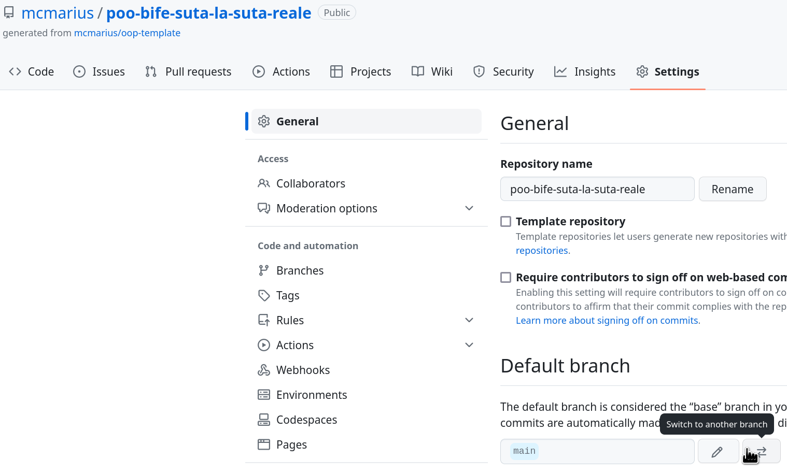
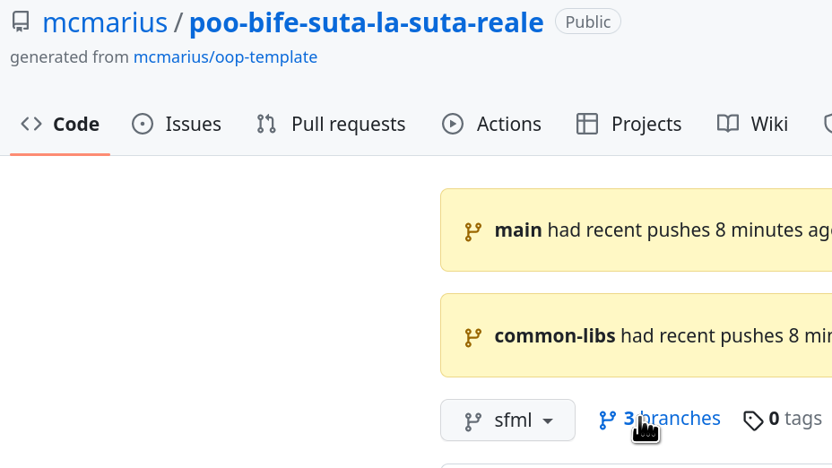
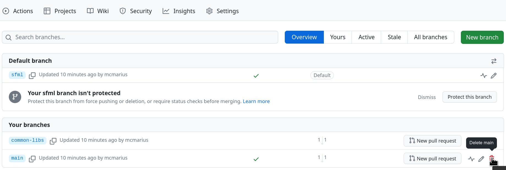
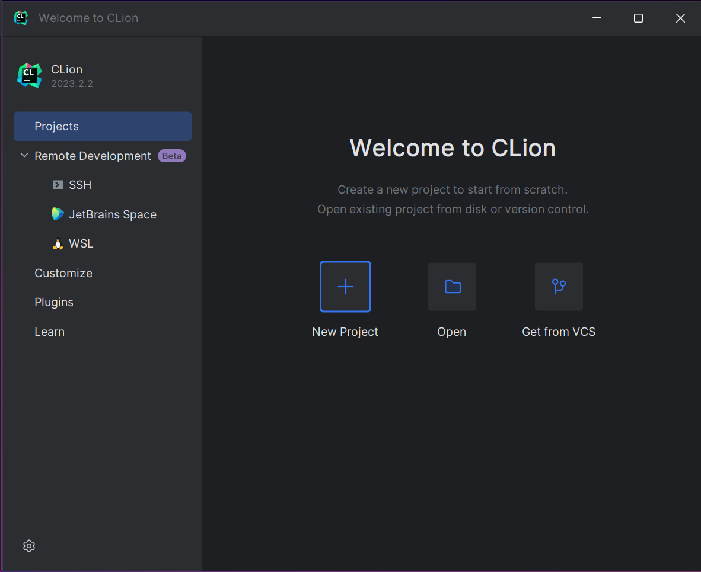
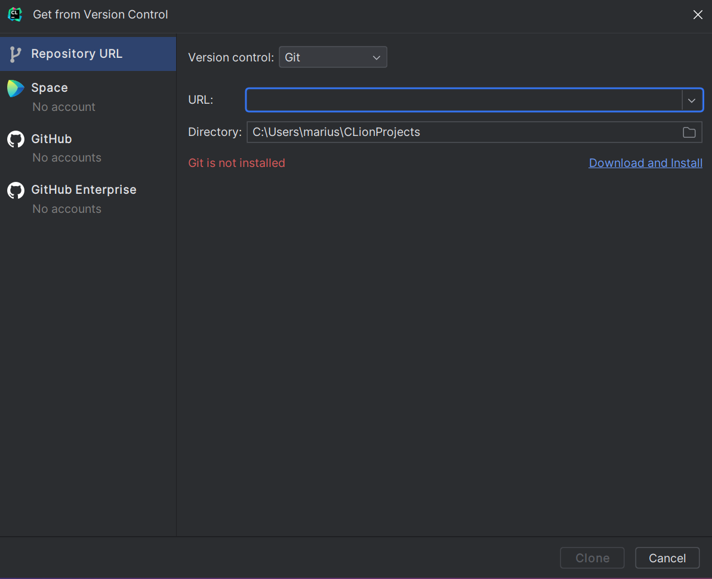
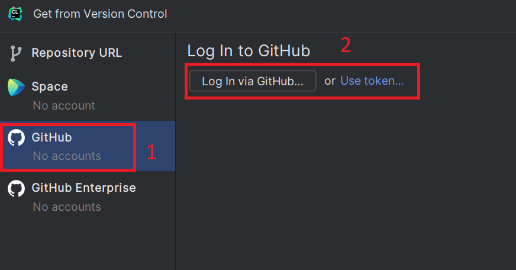
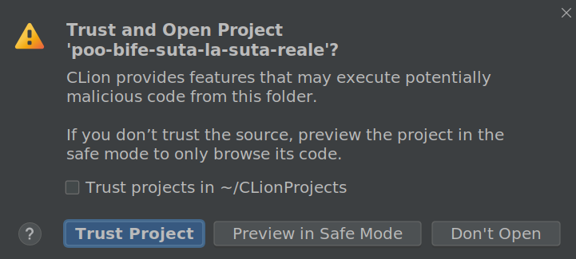
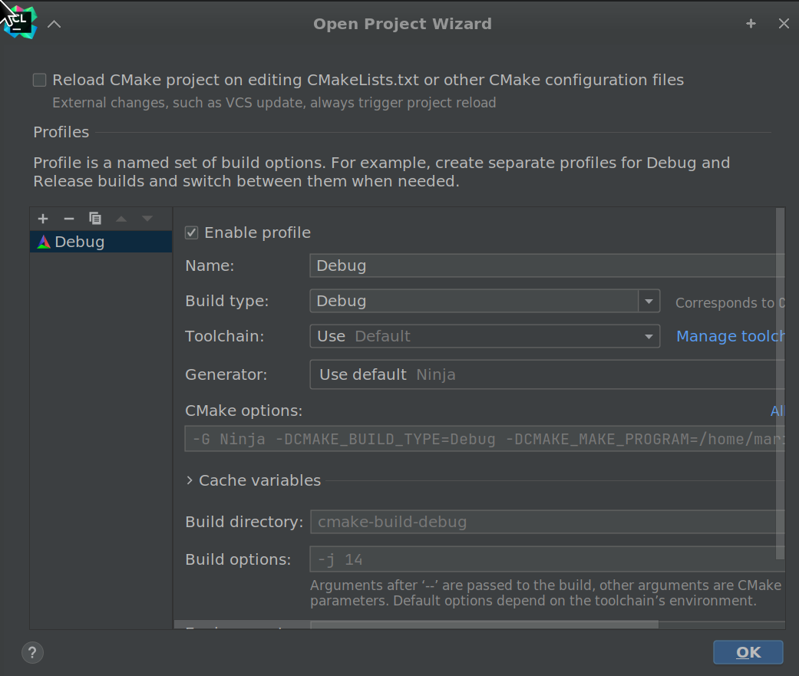
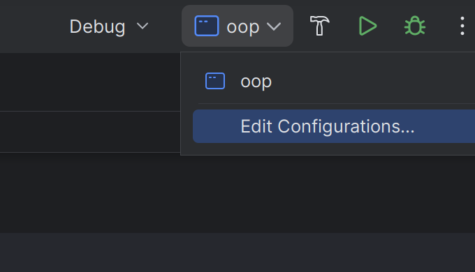
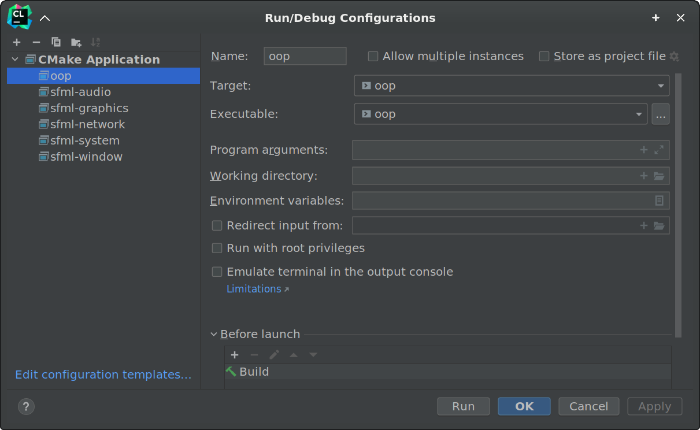

# Configurarea proiectului

Primul pas: creare cont de GitHub (dacă nu avem deja): https://github.com/signup

Pasul următor: crearea unui repository. Recomand să utilizați
[repository-ul template](https://github.com/mcmarius/oop-template),
deoarece are configurat tot ce veți avea nevoie.

Dacă dorim să folosim biblioteci externe, selectăm "Include all branches".
Pentru detalii, [vezi mai jos](#configurare-biblioteci-externe).

Introducem un nume și eventual o descriere.

Dacă selectați vizibilitatea proiectului privată, aveți cel mult 2000 de minute pe lună pentru
partea de CI (compilat/rulat/memory leaks), deci trebuie să vă pese mai mult să nu ruleze la infinit.

O rulare (un push de commit(s)) înseamnă cel mult 10 minute: 5 workflows rulează
programul vostru, ceea ce înseamnă 150 de minute (30*1 + 10*2 + 10*10, detalii
[aici](https://docs.github.com/en/billing/managing-billing-for-github-actions/about-billing-for-github-actions#included-storage-and-minutes)).
După vreo 13 commit-uri ați consumat tot pe luna respectivă.

**Indiferent de vizibilitatea proiectului, trebuie să rezolvați _toate_ erorile!**

După ce apăsăm pe "Create repository", avem 2 opțiuni:

- dacă nu dorim să folosim biblioteci externe, mergem direct la [acest pas](#configurare-proiect-din-ide)
- pentru biblioteci externe, este mai simplu de configurat din browser: vezi în continuare.

## Configurare biblioteci externe

Ne ducem la setările proiectului ("Settings"), apoi apăsăm pe butonul de schimbat branch-ul principal
cu 2 săgeți: "Switch to another branch" din cadrul rubricii "Default branch".

Schimbăm branch-ul și confirmăm modificarea:

Opțional, după această modificare am mai avea 2-3 pași de făcut:

- ștergem fostul branch `main` (sau `master`) pentru a putea refolosi numele:
  facem asta din pagina principală a proiectului

  
  

- redenumim noul branch principal în `main` (sau `master`):
  facem asta din setări de unde am schimbat mai devreme branch-ul principal

De abia **după** ce am terminat de redenumit branch-urile ar fi bine să ne clonăm proiectul local
(la noi pe calculator).

## Configurare proiect din IDE

Dăm click pe "Get from VCS".

Dacă programul `git` nu este instalat (sau nu este găsit în variabila de cale `PATH`),
dăm click pe butonul "Download and install":

După ce s-a instalat programul `git`, ne logăm pe contul de GitHub:

După ce ne-am logat, identificăm proiectul nostru în listă și îl selectăm pentru clonare,
apoi confirmăm că proiectul este de încredere ("Trust Project"):

La următoarea fereastră nu avem (momentan) nimic de modificat, apăsăm "OK":

După câteva secunde (sau minute), proiectul ar trebui să fie configurat.

Dacă avem fișiere pentru date de intrare, este necesar să configurăm directorul de lucru
(working directory).

Din dreapta sus dăm pe "Edit Configurations..." (sau din meniu -> Run -> "Edit Configurations..."):

După cum vedem, la "Working directory" nu este configurat nimic.

Dacă folosim biblioteca rlutil sau ceva similar pentru afișări mai speciale în terminal,
ar trebui să selectăm "Emulate terminal in the output console".

Avem 2 variante:

- variabilă de CMake
- selectare manuală

În prima variantă, dăm pe + și selectăm "ProjectFileDir":

Pentru a doua variantă, dăm pe butonul de "Browse", apoi pe al treilea buton din stânga
("Project Directory"), apoi "OK":

---

---

---

Pentru continuare, după ce e gata o parte din temă, vezi
[comenzile uzuale de git](./#comenzi-uzuale-de-git).

# Gata! 🎉

